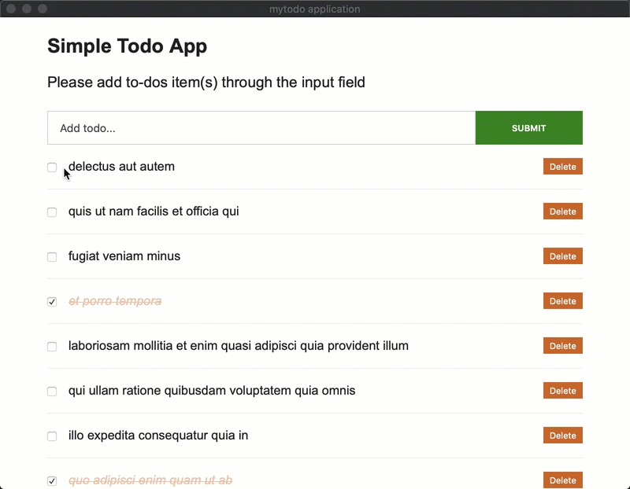
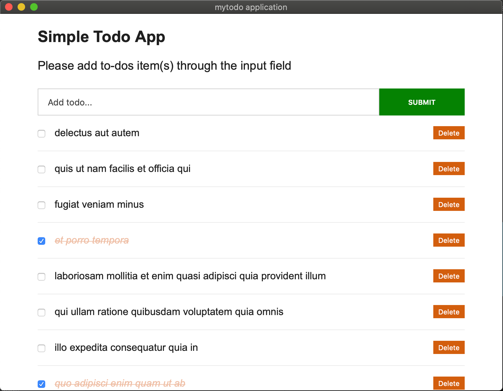

This is an experimental project for following content:

1) React App

​    Using create-react-app to build a SPA and reach hook has been used.

2) Tauri

   Using Tauri to build cross platform application package.

Mac Example:

Windows Example:

Outcome Example:

This project was bootstrapped with [Create React App](https://github.com/facebook/create-react-app).

React tutorial is from: https://ibaslogic.com/blog/react-tutorial-for-beginners/

Tauri is from: https://github.com/tauri-apps/tauri

